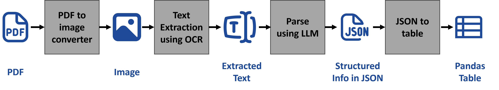

# Legal_record_Information_Extraction

This project focuses on extracting structured information from legal land records written in English, Hindi, and Marathi. The goal is to transform unstructured OCR text into a clean, machine-readable format using a modular pipeline.

* **PDF to Image converter :** We use the `pdf2image` library to convert land record PDFs into images. This step is crucial because our OCR model performs significantly better on images than directly on PDFs.

* **Optical Character Recognistion (OCR) :** OCR is used to convert printed or handwritten text in the images into machine-readable strings. The output text contains all the information present in the original document, including the details we need to extract.

* **LLM Parser :** The extracted OCR text is passed to a Large Language Model (LLM) using a carefully crafted prompt designed to extract key fields such as the date, village name, taluka, district, and owner names. The model returns the information in a structured JSON format. The `llama3-8b-8192` model by Meta is used for this task, accessed via the `Groq API` for high-speed inference.

* **JSON to Table :** The extracted JSON output is converted into a `pandas` DataFrame for further analysis or downstream processing.

## Repo Content

This repository contains the following files

1. `get_info_LegalDoc.ipynb` : A demonstration notebook that walks through the complete workflow, starting from a PDF input and going through image conversion, OCR, JSON extraction using an LLM, and finally converting the output into a DataFrame using a single legal land record as an example.

2. `LegalDoc_BulkProcess.ipynb` : This notebook extends the workflow to process multiple legal documents stored in the `MH_LandRecords_PDFs` folder. It automates extraction across all available files and compiles the results for bulk analysis or export.

3. `MH_LandRecords_PDFs/` : This folder contains the legal records that needs to be processed.

4. `outputs/` : This folder stores the results generated from the workflow execution.
    * `images/` : Contains land record images with annotated bounding boxes produced by the OCR model.
    * `jsons/` :  Contains structured JSON files with extracted information from the land records.

5. `process_results.ipynb` : A notebook that consolidates all the extracted JSON files into a single table or pandas DataFrame for further analysis or export.